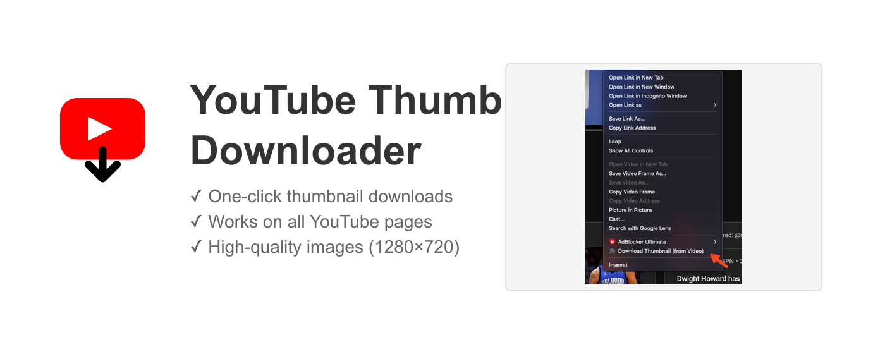

# YouTube Thumbnail Downloader

A Chrome extension that lets you easily download high-quality thumbnails from any YouTube video with just a right-click.



## Features

- Download thumbnails in maximum quality (1280x720)
- Works on all YouTube pages:
  - Video pages
  - Search results
  - Playlists
  - Channel pages
  - Homepage
- Simple right-click menu integration
- Offline capable
- No ads or tracking
- Privacy-focused with minimal permissions

## Installation

### From Chrome Web Store (Recommended)

1. Visit the [Chrome Web Store page](https://chrome.google.com/webstore/detail/youtube-thumbnail-downloader/[your-extension-id])
2. Click "Add to Chrome"
3. Click "Add extension" in the popup

### From Source (Development)

1. Clone this repository:
   ```bash
   git clone https://github.com/[your-username]/youtube-thumbnail-downloader.git
   ```

2. Open Chrome and go to `chrome://extensions/`

3. Enable "Developer mode" in the top right

4. Click "Load unpacked" and select the extension directory

## Usage

1. Navigate to any YouTube video or page with YouTube thumbnails
2. Right-click on a video thumbnail
3. Select "Download Thumbnail" from the context menu
4. The highest quality thumbnail will automatically download to your default downloads folder

## Development

### Prerequisites

- Node.js (v14 or higher)
- npm

### Setup

1. Install dependencies:
   ```bash
   npm install
   ```

2. Generate icons (if modifying):
   ```bash
   npm run generate-icons
   ```

3. Generate promotional images (if modifying):
   ```bash
   npm run generate-promos
   ```

### Building

The extension doesn't require a build step. You can load it directly into Chrome in developer mode.

## Privacy

This extension:
- Does not collect any user data
- Works completely offline
- Requires minimal permissions
- Uses no external services

See our [Privacy Policy](PRIVACY.md) for more details.

## Contributing

1. Fork the repository
2. Create a feature branch (`git checkout -b feature/amazing-feature`)
3. Commit your changes (`git commit -m 'feat: add amazing feature'`)
4. Push to the branch (`git push origin feature/amazing-feature`)
5. Open a Pull Request

## License

This project is licensed under the MIT License - see the [LICENSE](LICENSE) file for details.

## Version History

See [CHANGELOG.md](CHANGELOG.md) for a list of changes and versions. 